# RustyWorm: Universal AI Mimicry Engine — Technical Pitch Deck

## Diagrams, Data Flows & Architecture

---

## 1. System Architecture Overview


---

## 2. Request Processing Data Flow


---

## 3. Compound Feedback Loop (Core Innovation)

```mermaid
flowchart TB
    subgraph LOOP["♾️ Compound Feedback Loop"]
        direction TB
        
        OBS["1. OBSERVE<br/>Raw model response ingested"]
        ANALYZE["2. ANALYZE (System 2)<br/>Pattern detection:<br/>Opening, Hedging, Tone,<br/>Reasoning, Structure"]
        SIG["3. BUILD SIGNATURE<br/>BehaviorSignature with<br/>pattern frequencies & types"]
        PROFILE["4. REFINE PROFILE<br/>apply_correction() adjusts<br/>personality axes via delta"]
        COMPILE["5. COMPILE → CACHE (S2→S1)<br/>CachedSignature::compile_from()<br/>Bridge: deep analysis → fast lookup"]
        TEMPLATE["6. GENERATE (System 1)<br/>TemplateLibrary uses<br/>refined profile for output"]
        MONITOR["7. SELF-MONITOR<br/>Compare output to target signature<br/>Generate PersonalityDelta"]
        FEEDBACK["8. APPLY FEEDBACK<br/>Delta compounds into:<br/>• ToneBlender drift<br/>• HedgingInjector levels<br/>• Fragment confidence<br/>• Profile corrections"]
    end

    OBS --> ANALYZE
    ANALYZE --> SIG
    SIG --> PROFILE
    PROFILE --> COMPILE
    COMPILE --> TEMPLATE
    TEMPLATE --> MONITOR
    MONITOR --> FEEDBACK
    FEEDBACK -->|"Loop: each iteration<br/>compounds on previous"| ANALYZE

    DRIFT["DriftDetector<br/>Linear regression on<br/>convergence window"]
    MILE["MilestoneTracker<br/>25% → 50% → 75% → 90% → 95%"]
    
    FEEDBACK --> DRIFT
    FEEDBACK --> MILE
    DRIFT -->|"Drift detected"| OBS
    MILE -->|"Auto-save trigger"| PERSIST["PersistenceManager"]

    style LOOP fill:#0d1117,stroke:#bc8cff,color:#c9d1d9
    style DRIFT fill:#1a1a2a,stroke:#f85149,color:#c9d1d9
    style MILE fill:#1a1a2a,stroke:#3fb950,color:#c9d1d9
    style PERSIST fill:#1a1a2a,stroke:#f0883e,color:#c9d1d9
```



---

## 4. Evolution Pipeline

```mermaid
stateDiagram-v2
    [*] --> Observation : Initial mimicry
    
    Observation --> Learning : Patterns detected ≥ threshold
    Learning --> Refinement : Convergence > 50%
    Refinement --> Converged : Convergence > 90%
    Converged --> Drifting : Negative slope detected
    Drifting --> Learning : Correction applied
    
    note right of Observation
        Phase 1: Collecting raw data
        • BehaviorAnalyzer ingests responses
        • Pattern frequency maps built
        • Training data stored for replay
    end note
    
    note right of Learning
        Phase 2: Profile refinement
        • Signature compiled to cache
        • PersonalityDelta applied
        • Template library warming
    end note
    
    note right of Refinement
        Phase 3: Fine-tuning
        • Self-monitoring active
        • Compound corrections shrinking
        • Milestones: 75%, 90%
    end note
    
    note right of Converged
        Phase 4: Stable mimicry
        • System 1 hit rate high
        • Drift detector watching
        • Auto-save at 95%
    end note
    
    note right of Drifting
        Phase 5: Correction needed
        • Linear regression slope negative
        • Patience counter active
        • Re-enter learning with new data
    end note
```



---

## 5. API Observation Workflow


---

## 6. Convergence Metrics & Performance Data


### Performance Characteristics


### Module Size & Test Coverage


---

## 7. Persistence & Checkpoint Data Flow


---

## 8. Ethics Enforcement Flowchart (ConsciousAI Trait)


---

## 9. Module Integration Matrix

```mermaid
block-beta
    columns 7
    
    block:header:7
        H["Module Integration Matrix — Every Module Compounds Into Every Other"]
    end
    
    space A["Profile"] B["Analyzer"] C["Cache"] D["Templates"] E["Evolution"] F["Persist"]
    
    A1["Profile"] A2["—"] A3["refine_profile()"] A4["compile_from()"] A5["for_profile()"] A6["apply_correction()"] A7["save_profile()"]
    
    B1["Analyzer"] B2["from_signature()"] B3["—"] B4["build → cache"] B5["self_monitor()"] B6["convergence_history"] B7["save in session"]
    
    C1["Cache"] C2["warm_up()"] C3["cache miss → analyze"] C4["—"] C5["fast tone lookup"] C6["hit_rate metrics"] C7["checkpoint"]
    
    D1["Templates"] D2["from AiProfile"] D3["apply_feedback(delta)"] D4["tone cache"] D5["—"] D6["feedback count"] D7["serialize"]
    
    E1["Evolution"] E2["training_loop()"] E3["step(convergence)"] E4["auto warm-up"] E5["drift → retrain"] E6["—"] E7["auto-save trigger"]
    
    F1["Persist"] F2["load profile"] F3["load signature"] F4["restore cache"] F5["restore templates"] F6["load milestones"] F7["—"]
    
    style header fill:#1a1a2a,stroke:#67e8f9,color:#fff
```



### Compound Integration Map (Directed)

```mermaid
graph LR
    PROF["AiProfile<br/>🧬"]
    ANA["BehaviorAnalyzer<br/>🔬"]
    CACHE["SignatureCache<br/>⚡"]
    TMPL["TemplateStore<br/>📝"]
    EVO["EvolutionTracker<br/>📈"]
    PERS["PersistenceManager<br/>💾"]
    API["ApiObserver<br/>🌐"]
    CAPS["ModalityRouter<br/>🔌"]
    ETHICS["ConsciousAI<br/>⚖️"]

    PROF -->|"from_signature()"| ANA
    ANA -->|"refine_profile()"| PROF
    ANA -->|"compile_from()"| CACHE
    CACHE -->|"cache miss"| ANA
    PROF -->|"get_or_create()"| TMPL
    ANA -->|"self_monitor → delta"| TMPL
    TMPL -->|"apply_feedback()"| PROF
    EVO -->|"training_loop()"| ANA
    EVO -->|"step()"| PROF
    EVO -->|"auto_save"| PERS
    PERS -->|"load"| PROF
    PERS -->|"checkpoint"| CACHE
    API -->|"responses"| ANA
    API -->|"training data"| EVO
    PROF -->|"for_profile()"| CAPS
    ETHICS -->|"enforce"| PROF
    ETHICS -->|"evaluate"| TMPL

    style PROF fill:#2d1b69,stroke:#a78bfa
    style ANA fill:#1e3a5f,stroke:#60a5fa
    style CACHE fill:#1a3a2a,stroke:#4ade80
    style TMPL fill:#3b2f1a,stroke:#fbbf24
    style EVO fill:#1a3a3a,stroke:#2dd4bf
    style PERS fill:#3a2a1a,stroke:#fb923c
    style API fill:#1a2a3a,stroke:#38bdf8
    style CAPS fill:#2a1a1a,stroke:#f87171
    style ETHICS fill:#3b1a2a,stroke:#f472b6
```



---

## 10. Technical Differentiators

```mermaid
mindmap
    root((RustyWorm))
        Dual-Process Architecture
            System 1: O(1) HashMap cache
            System 2: Deep pattern analysis
            Compound bridge: compile_from()
            Automatic routing on cache hit/miss
        Compound Feedback Loops
            Every module feeds every other
            PersonalityDelta as universal currency
            Self-monitoring always produces ≥1 adjustment
            Convergence compounds over iterations
        Zero-Copy Persona Switching
            HotSwap with preloaded JSON snapshots
            InstinctiveRouter keyword scoring
            6 built-in profiles + unlimited custom
            Blend any two personas with weighted merge
        Evolution Engine
            5-phase state machine
            DriftDetector with linear regression
            MilestoneTracker with auto-save triggers
            TrainingDataManager with quality eviction
            ASCII convergence visualization
        Ethics-First Design
            ConsciousAI trait mandatory
            Prime Directive enforcement on every action
            Parasitism detection with 4-tier risk
            Symbiosis scoring via geometric mean
        Full Persistence
            Serde on entire state tree
            Manifest-indexed file storage
            Engine checkpoints for full restore
            Profile import/export for sharing
        Live API Observation
            4 providers: OpenAI, Anthropic, Google, Ollama
            Real-time signature building from API responses
            Cross-provider comparison with similarity matrix
            10-prompt study mode for comprehensive profiling
        Rust Performance
            Zero-cost abstractions
            No garbage collector
            Memory-safe without runtime overhead
            9,800+ lines, 149 tests, zero warnings
```

---

## Slide-Ready Summary Data

### Key Metrics

| Metric | Value |
|--------|-------|
| Total Source Lines | ~9,800 |
| Test Count | 149 (100% pass) |
| Built-in Model Profiles | 6 (GPT-4o, Claude, o1, Gemini, LLaMA, RustyWorm) |
| Supported API Providers | 4 (OpenAI, Anthropic, Google, Ollama) |
| Evolution Phases | 5 (Observation → Learning → Refinement → Converged → Drifting) |
| Convergence Milestones | 5 (25%, 50%, 75%, 90%, 95%) |
| Serializable Types | 40+ (full serde on entire state tree) |
| System 1 Lookup | O(1) HashMap |
| Persona Switch Time | Instant (HotSwap preloaded JSON) |
| Compiler Warnings | 0 (from RustyWorm code) |
| Dependencies | 4 (rand, serde, serde_json, reqwest[optional]) |
| Minimum Rust Version | 1.93.0 |

### Architecture Stats

| Layer | Modules | Purpose |
|-------|---------|---------|
| System 1 (Fast) | cache, templates, HotSwap, InstinctiveRouter | <1ms response generation |
| System 2 (Deep) | analyzer, profile, capability | Pattern analysis & profile refinement |
| Evolution | evolution (DriftDetector, MilestoneTracker, TrainingDataManager) | Convergence tracking & training loops |
| Persistence | persistence (PersistenceManager, Manifest, Checkpoint) | Full state save/load/export |
| API | api (ApiObserver, ApiClient, 4 providers) | Live model observation |
| Ethics | consciousness (ConsciousAI, ConsciousnessEthics) | Prime Directive enforcement |
| Orchestrator | engine (MimicryEngine, CompoundPersona, MimicSession) | Dual-process coordination |

### Compound Integration Count

Every module has bidirectional data flow with every other module. The integration matrix shows **42 distinct compound pathways** across 7 core modules — this is what makes RustyWorm's mimicry fidelity compound over time rather than plateau.
